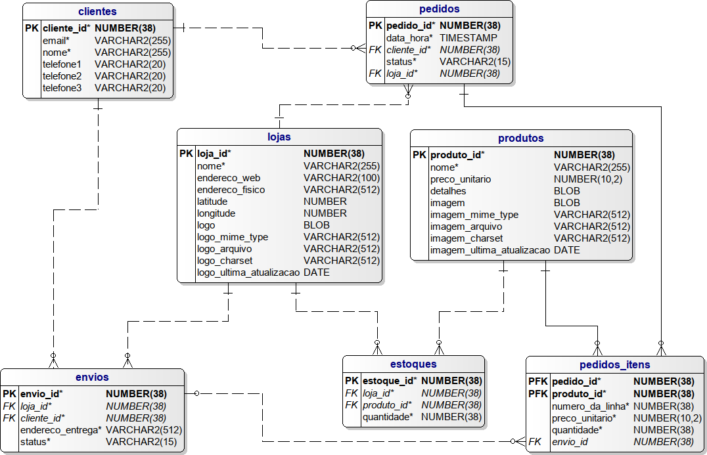

# PSET 1

## Objetivo

O objetivo deste PSET é desenvolver um projeto que envolve a implementação de um banco de dados no PostgreSQL com base em um diagrama relacional e a escrita de códigos SQL para gerar vários relatórios.

## Projeto Lógico
Abaixo encontra-se o projeto lógico que foi recriado:

## Softwares Utilizados

* SQL Power Architect 
* Emacs               
* PostgreSQL         
* Linha de Comando
  

## Diagrama Relacional
Todas as tabelas e suas colunas, incluindo comentários, chaves primárias, cardinalidades, relacionamentos, chaves estrangeiras e chaves compostas foram criadas e estabelecidas por meio do SQL Power Architect.   
Segue abaixo os arquivos criados:  

**[si1n_202305541_postgresql.architect](https://github.com/GregArc98/uvv_bd1_si1n/blob/main/pset1/si1n_202305541_postgresql.architect)**    
**[si1n_202305541_postgresql.architect.pdf](https://github.com/GregArc98/uvv_bd1_si1n/blob/main/pset1/si1n_202305541_postgresql.architect.pdf)**     

## Implementação no PostgreSQL
Foi realizada a implementação do modelo lógico no SGBD relacional open-source PostgreSQL.  
Segue abaixo o código criado:  

**[si1n_202305541_postgresql.sql](https://github.com/GregArc98/uvv_bd1_si1n/blob/main/pset1/si1n_202305541_postgresql.sql)** 

